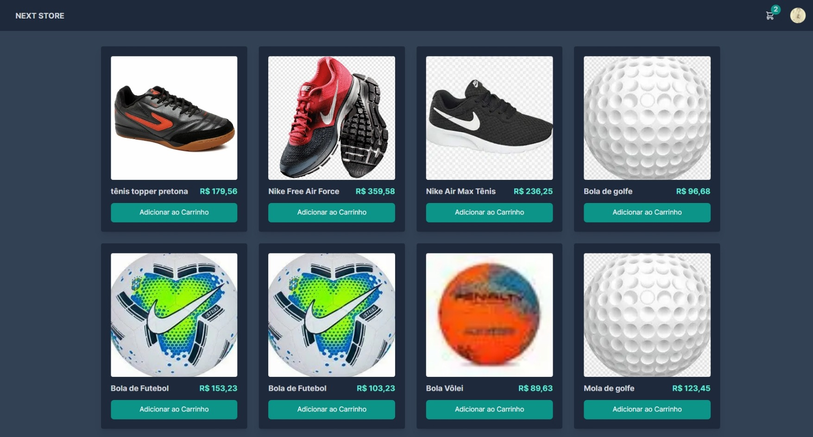

# Next-Commerce



## Descrição

Este é um projeto de comércio eletrônico baseado em Next.js 13 que utiliza várias tecnologias para fornecer funcionalidades avançadas, incluindo integração com Stripe para pagamentos, autenticação e gerenciamento de usuários com Clerk e um banco de dados hospedado no serviço Vercel Postgres.

## Recursos

- **Stripe**: Integre pagamentos seguros com cartões de crédito e outros métodos de pagamento utilizando o Stripe. Veja a seção abaixo para configuração.

- **Clerk**: Gerencie autenticação e controle de acesso de usuários com Clerk. Veja a seção abaixo para configuração.

- **Vercel Postgres**: Armazene dados de aplicativos em um banco de dados Postgres hospedado na plataforma Vercel. Veja a seção abaixo para configuração.

## Variáveis de Ambiente

As variáveis de ambiente usadas neste projeto podem ser encontradas no arquivo [`typings.d.ts`](typings.d.ts) na raiz do projeto. Este arquivo fornece a definição das variáveis de ambiente e seus tipos.

## Configuração

### Stripe

1. Crie uma conta no [Stripe](https://stripe.com) se ainda não tiver uma.

2. Após criar sua conta no Stripe, obtenha as chaves de API, incluindo a chave secreta (`STRIPE_SECRET_KEY`) e a chave pública (`NEXT_PUBLIC_STRIP_PUBLISHABLE_KEY`).

3. Configure as chaves em suas variáveis de ambiente conforme mostrado no arquivo `.env.local`. Exemplo:

   ```plaintext
   STRIPE_SECRET_KEY=your_secret_key_here
   NEXT_PUBLIC_STRIP_PUBLISHABLE_KEY=your_publishable_key_here
   ```

### Clerk

1. Crie uma conta no [Clerk](https://clerk.dev) se ainda não tiver uma.

2. Configure o projeto Clerk com suas preferências de autenticação e acesso.

3. Após configurar o projeto no Clerk, obtenha a chave secreta (`CLERK_SECRET_KEY`) e a chave secreta do webhook (`CLERK_WEBHOOK_SECRET`).

4. Configure as chaves em suas variáveis de ambiente conforme mostrado no arquivo `.env.local`. Exemplo:

   ```plaintext
   CLERK_SECRET_KEY=your_secret_key_here
   CLERK_WEBHOOK_SECRET=your_webhook_secret_here
   ```

### Vercel Postgres

1. Utilize o serviço de banco de dados do Vercel para configurar um banco de dados Postgres.

2. Obtenha a URL de conexão para o banco de dados Postgres e configure a variável de ambiente `POSTGRES_URL` com essa URL. Exemplo:

   ```plaintext
   POSTGRES_URL=your_postgres_connection_url_here
   ```

## Executando o Projeto

1. Instale as dependências:

   ```bash
   npm install
   ```

2. Inicie o aplicativo em modo de desenvolvimento:

   ```bash
   npm run dev
   ```

3. Acesse o aplicativo em [http://localhost:3000](http://localhost:3000).

Para seguir o passo a passo deste projeto, basta acompanhar a explicação detalhada no tutorial no YouTube: [Next.js 13 E-Commerce](https://www.youtube.com/watch?v=tWv1vboUDpY&t=3908s), com a didática apresentada por [Lucas Nhimi](https://www.linkedin.com/in/lucasnhimi/). Desfrute desta jornada de construir o seu próprio comércio eletrônico!
